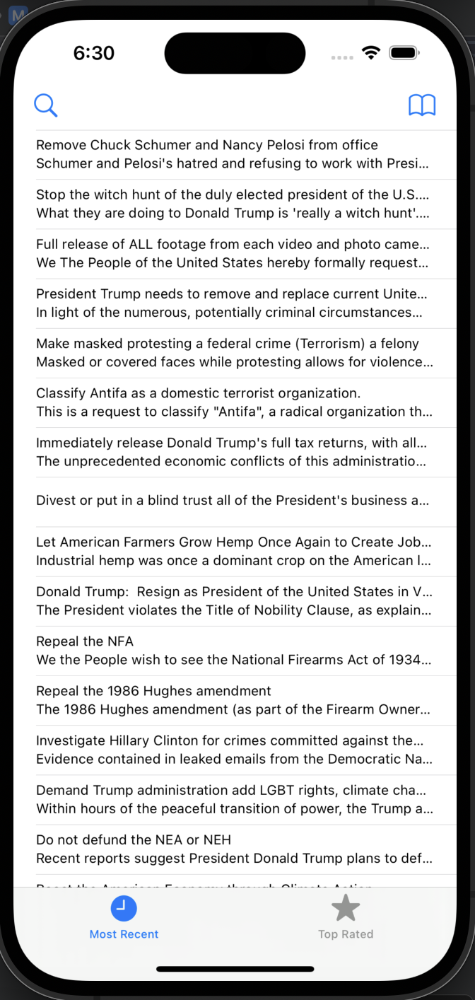
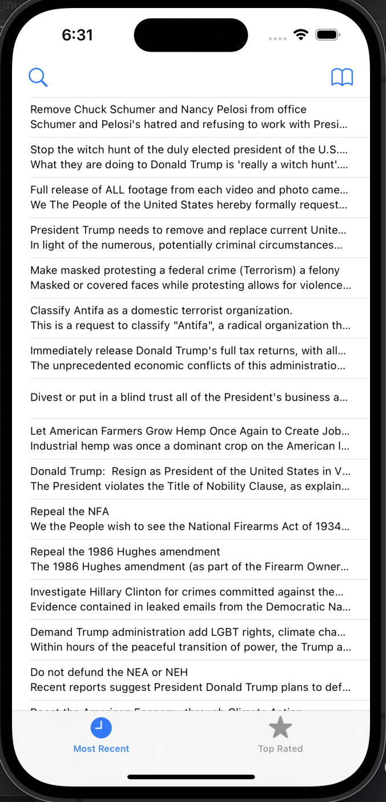

# 100-days-of-swift

Esse projeto conterá os ensinamentos e os projetos disponíveis no 100 Days of Swift (https://www.hackingwithswift.com/100) com o objetivo de expandir meus conhecimentos acerca da linguagem.

## Projetos

| Projeto  | Descrição  | Imagem  |
|----------|------------|---------|
| **Projeto 1** | Exibir Imagens (Visualização de Tabela) | 

 |
| **Projeto 2** | Jogo das Bandeiras | 

 |
| **Projeto 3** | Compartilhamento de Imagens (Projeto 1) | 

 |
| **Projeto 4** | Páginas Web | 

 |
| **Projeto 5** | Jogo de anagramas | 

 |
| **Projeto 6** | Auto layout | 

 |
| **Projeto 7** | Exibe dados da web | 

 |
| **Projeto 8** | Jogo de acertar palavras | 

 |
| **Projeto 9** | Implementação do Grand Central Dispatch no projeto 7 | 

 |
| **Projeto 10** | UICollectionViewCell para agrupar imagens e textos | 

 |
| **Projeto 11** | Jogo com SpriteKit | 

 |
| **Projeto 12** | Adicionar imagens e nomes a uma coleção | 

 |
| **Projeto 13** | Aplicar filtros Core Image | 

 |
| **Projeto 14** | Jogo em SpriteKit de acertar pinguins | 

 |
| **Projeto 15** | Utilizando animação no SpriteKit | 

 |
| **Projetos 13-15** | Utilizar dados JSON para retornar valores | 

 |
| **Projeto 16** | Novo framework MapKit | 

 |
