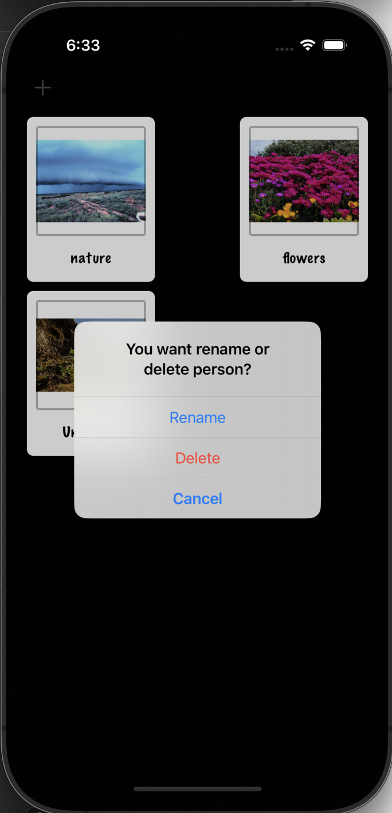
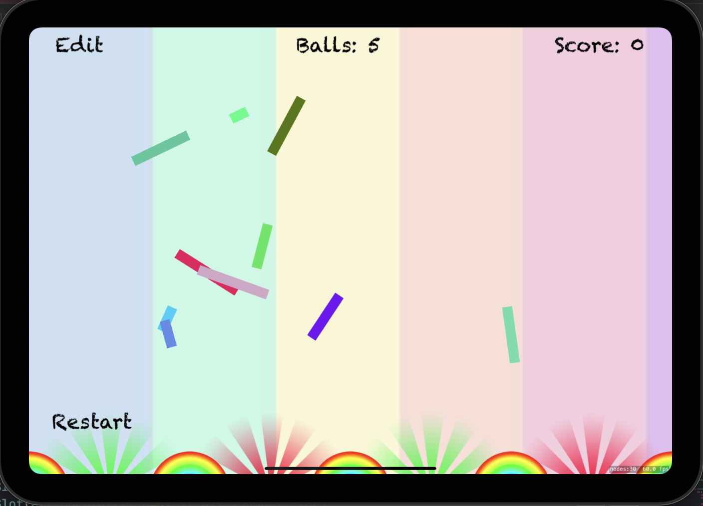

# 100-days-of-swift

Esse projeto conterá os ensinamentos e os projetos disponíveis no 100 Days of Swift (https://www.hackingwithswift.com/100) com o objetivo de expandir meus conhecimentos acerca da linguagem.

### Projeto 1 

Exibir imagens (visualização de tabela)

### Projeto 2

Jogo das bandeiras

### Projeto 3

Implementação de compartilhamento de imagens do projeto 1

### Projeto 4

Páginas web

### Projeto 5

Jogo de anagramas

### Projeto 6

Auto layout

### Projeto 7

Exibe dados da web

### Projeto 8

Jogo de acertar palavras

### Projeto 9

Implementação do Grand Central Dispatch no projeto 7

### Projeto 10

Adicionar imagens e nomes a uma coleção

### Projeto 11

Jogo com SpriteKit

### Projeto 12

Salvar informações do projeto 10 com NSCoding e Codable

### Projeto 13

Aplicar filtros Core Image

